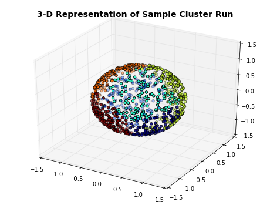
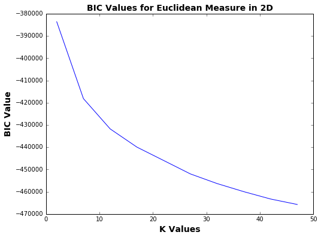
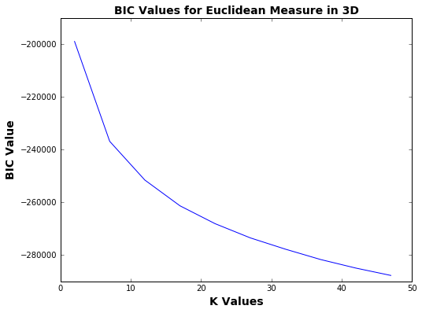

```python
import csv
import pandas as pd
from matplotlib import pyplot as plt
import numpy as np
from astropy import units as u
from astropy.coordinates import SkyCoord
from sklearn.cluster import KMeans
from mpl_toolkits.mplot3d import Axes3D
import matplotlib.pyplot as plt
import math
from sklearn import cluster
from scipy.spatial import distance
%matplotlib inline
```

### Read in Data


```python
data = pd.read_csv('tychos2_updated.tsv', sep = ';', header = 0)
data['_Glat'] = data['_Glat'].convert_objects(convert_numeric = True)
data['_Glat'] = pd.to_numeric(data['_Glat'])
data['_Glon'] = data['_Glon'].convert_objects(convert_numeric = True)
data['_Glon'] = data['_Glon'].replace("        ", np.nan)
data['_Glon'] = pd.to_numeric(data['_Glon'])
data['VTmag'] = data['VTmag'].convert_objects(convert_numeric = True)
data['VTmag'] = pd.to_numeric(data['VTmag'])
data['BTmag'] = data['BTmag'].convert_objects(convert_numeric = True)
data['BTmag'] = pd.to_numeric(data['BTmag'])
data['HIP'] = data['HIP'].convert_objects(convert_numeric = True)
data['HIP'] = pd.to_numeric(data['HIP'])
data.head()
```

    /Library/Frameworks/Python.framework/Versions/2.7/lib/python2.7/site-packages/IPython/core/interactiveshell.py:2902: DtypeWarning: Columns (13,14) have mixed types. Specify dtype option on import or set low_memory=False.
      interactivity=interactivity, compiler=compiler, result=result)
    /Library/Frameworks/Python.framework/Versions/2.7/lib/python2.7/site-packages/ipykernel/__main__.py:2: FutureWarning: convert_objects is deprecated.  Use the data-type specific converters pd.to_datetime, pd.to_timedelta and pd.to_numeric.
      from ipykernel import kernelapp as app
    /Library/Frameworks/Python.framework/Versions/2.7/lib/python2.7/site-packages/ipykernel/__main__.py:4: FutureWarning: convert_objects is deprecated.  Use the data-type specific converters pd.to_datetime, pd.to_timedelta and pd.to_numeric.
    /Library/Frameworks/Python.framework/Versions/2.7/lib/python2.7/site-packages/pandas/core/common.py:449: FutureWarning: elementwise comparison failed; returning scalar instead, but in the future will perform elementwise comparison
      mask = arr == x
    /Library/Frameworks/Python.framework/Versions/2.7/lib/python2.7/site-packages/ipykernel/__main__.py:7: FutureWarning: convert_objects is deprecated.  Use the data-type specific converters pd.to_datetime, pd.to_timedelta and pd.to_numeric.
    /Library/Frameworks/Python.framework/Versions/2.7/lib/python2.7/site-packages/ipykernel/__main__.py:9: FutureWarning: convert_objects is deprecated.  Use the data-type specific converters pd.to_datetime, pd.to_timedelta and pd.to_numeric.
    /Library/Frameworks/Python.framework/Versions/2.7/lib/python2.7/site-packages/ipykernel/__main__.py:11: FutureWarning: convert_objects is deprecated.  Use the data-type specific converters pd.to_datetime, pd.to_timedelta and pd.to_numeric.


<div>
<table border="1" class="dataframe">
  <thead>
    <tr style="text-align: right;">
      <th></th>
      <th>_Glon</th>
      <th>_Glat</th>
      <th>_RAJ2000</th>
      <th>_DEJ2000</th>
      <th>_RAB1950</th>
      <th>_DEB1950</th>
      <th>TYC1</th>
      <th>TYC2</th>
      <th>TYC3</th>
      <th>RAmdeg</th>
      <th>DEmdeg</th>
      <th>pmRA</th>
      <th>pmDE</th>
      <th>BTmag</th>
      <th>VTmag</th>
      <th>HIP</th>
      <th>RA(ICRS)</th>
      <th>DE(ICRS)</th>
    </tr>
  </thead>
  <tbody>
    <tr>
      <th>0</th>
      <td>102.1846</td>
      <td>-58.9308</td>
      <td>2.317504</td>
      <td>2.231844</td>
      <td>1.676697</td>
      <td>1.953729</td>
      <td>1</td>
      <td>8</td>
      <td>1</td>
      <td>2.31750494</td>
      <td>2.23184345</td>
      <td>-16.3</td>
      <td>-9.0</td>
      <td>12.146</td>
      <td>12.146</td>
      <td>NaN</td>
      <td>2.317542</td>
      <td>2.231864</td>
    </tr>
    <tr>
      <th>1</th>
      <td>100.0429</td>
      <td>-58.5030</td>
      <td>1.125582</td>
      <td>2.267394</td>
      <td>0.484371</td>
      <td>1.989021</td>
      <td>1</td>
      <td>13</td>
      <td>1</td>
      <td>1.12558209</td>
      <td>2.26739400</td>
      <td>27.7</td>
      <td>-0.5</td>
      <td>10.488</td>
      <td>8.670</td>
      <td>NaN</td>
      <td>1.125519</td>
      <td>2.267396</td>
    </tr>
    <tr>
      <th>2</th>
      <td>99.6711</td>
      <td>-58.8253</td>
      <td>1.056865</td>
      <td>1.897832</td>
      <td>0.416434</td>
      <td>1.620063</td>
      <td>1</td>
      <td>16</td>
      <td>1</td>
      <td>1.05686490</td>
      <td>1.89782870</td>
      <td>-25.9</td>
      <td>-44.4</td>
      <td>12.921</td>
      <td>12.100</td>
      <td>NaN</td>
      <td>1.056924</td>
      <td>1.897933</td>
    </tr>
    <tr>
      <th>3</th>
      <td>97.7805</td>
      <td>-58.5759</td>
      <td>0.050939</td>
      <td>1.771467</td>
      <td>359.409848</td>
      <td>1.493348</td>
      <td>1</td>
      <td>17</td>
      <td>1</td>
      <td>0.05059802</td>
      <td>1.77144349</td>
      <td>32.1</td>
      <td>-20.7</td>
      <td>11.318</td>
      <td>10.521</td>
      <td>NaN</td>
      <td>0.050866</td>
      <td>1.771514</td>
    </tr>
    <tr>
      <th>4</th>
      <td>97.7796</td>
      <td>-58.5757</td>
      <td>0.050449</td>
      <td>1.771435</td>
      <td>359.409358</td>
      <td>1.493316</td>
      <td>1</td>
      <td>17</td>
      <td>2</td>
      <td>0.05059802</td>
      <td>1.77144349</td>
      <td>32.1</td>
      <td>-20.7</td>
      <td>10.772</td>
      <td>10.093</td>
      <td>NaN</td>
      <td>0.050376</td>
      <td>1.771482</td>
    </tr>
  </tbody>
</table>
</div>


### Take Random Subset of Data


```python
sub = data[[0,1]].sample(n = 1000) # take random sample of data
#sub = data[[0,1]] # all data
```

### Create SkyCoord Object
Save new columns in the dataframe as the cartesian coordinates of the galactic coordinates.
Now have galactic latitude and longitude, cartesian x, y, z


```python
coord = SkyCoord(sub['_Glon'], sub['_Glat'], frame = 'galactic', unit = 'deg')
sub['x'] = coord.cartesian.x
sub['y'] = coord.cartesian.y
sub['z'] = coord.cartesian.z
sub.head()
```


<div>
<table border="1" class="dataframe">
  <thead>
    <tr style="text-align: right;">
      <th></th>
      <th>_Glon</th>
      <th>_Glat</th>
      <th>x</th>
      <th>y</th>
      <th>z</th>
    </tr>
  </thead>
  <tbody>
    <tr>
      <th>33474</th>
      <td>192.9633</td>
      <td>11.5396</td>
      <td>-0.954816</td>
      <td>-0.219792</td>
      <td>0.200045</td>
    </tr>
    <tr>
      <th>9556</th>
      <td>153.3100</td>
      <td>-52.9004</td>
      <td>-0.538931</td>
      <td>0.270936</td>
      <td>-0.797588</td>
    </tr>
    <tr>
      <th>59285</th>
      <td>222.2524</td>
      <td>80.5787</td>
      <td>-0.121164</td>
      <td>-0.110067</td>
      <td>0.986511</td>
    </tr>
    <tr>
      <th>54675</th>
      <td>142.1316</td>
      <td>52.0647</td>
      <td>-0.485314</td>
      <td>0.377377</td>
      <td>0.788705</td>
    </tr>
    <tr>
      <th>27052</th>
      <td>210.1639</td>
      <td>-17.3856</td>
      <td>-0.825093</td>
      <td>-0.479520</td>
      <td>-0.298801</td>
    </tr>
  </tbody>
</table>
</div>


### Cell for testing transformations
ICRS, spherical, etc...,


```python

```

### Add unique obs column and drop NA values


```python
sub['obs'] = np.arange(1,len(sub)+1, 1)
sub = sub.dropna()
sub.head()
```


<div>
<table border="1" class="dataframe">
  <thead>
    <tr style="text-align: right;">
      <th></th>
      <th>_Glon</th>
      <th>_Glat</th>
      <th>x</th>
      <th>y</th>
      <th>z</th>
      <th>obs</th>
    </tr>
  </thead>
  <tbody>
    <tr>
      <th>33474</th>
      <td>192.9633</td>
      <td>11.5396</td>
      <td>-0.954816</td>
      <td>-0.219792</td>
      <td>0.200045</td>
      <td>1</td>
    </tr>
    <tr>
      <th>9556</th>
      <td>153.3100</td>
      <td>-52.9004</td>
      <td>-0.538931</td>
      <td>0.270936</td>
      <td>-0.797588</td>
      <td>2</td>
    </tr>
    <tr>
      <th>59285</th>
      <td>222.2524</td>
      <td>80.5787</td>
      <td>-0.121164</td>
      <td>-0.110067</td>
      <td>0.986511</td>
      <td>3</td>
    </tr>
    <tr>
      <th>54675</th>
      <td>142.1316</td>
      <td>52.0647</td>
      <td>-0.485314</td>
      <td>0.377377</td>
      <td>0.788705</td>
      <td>4</td>
    </tr>
    <tr>
      <th>27052</th>
      <td>210.1639</td>
      <td>-17.3856</td>
      <td>-0.825093</td>
      <td>-0.479520</td>
      <td>-0.298801</td>
      <td>5</td>
    </tr>
  </tbody>
</table>
</div>


### Function for calculating BIC


```python
def get_bic(dframe, modobj, distance_measure):
    """
    Computes BIC measure for clusters
    Parameters:
    -----------------------------------
    dframe: dataframe with labels from clustering appended
    modobj: sklearn object from kmeans cluster
    distance_measure: which distance using to measure between clusters ('euclidean', 'cosine',..)
    
    Returns:
    -----------------------------------
    BIC: BIC measure for clusters
    """
    X = sub.as_matrix(columns = dframe.columns[::])
    N, d = X.shape
    centers = [modobj.cluster_centers_]
    labels  = modobj.labels_
    #number of clusters
    m = modobj.n_clusters
    # size of the clusters
    n = np.bincount(labels)
    cl_var = (1.0 /(N - m)/d)*sum([sum(distance.cdist(X[np.where(labels == i)], [centers[0][i]], distance_measure)**2) for i in range(m)])
    const_term = 0.5 * m * np.log(N) * (d+1)    
  
    BIC = np.sum([n[i] * np.log10(n[i]) -
           n[i] * np.log10(N) -
         ((n[i] * d) / 2) * np.log10(2*np.pi) -
          (n[i] / 2) * np.log10(cl_var) -
         ((n[i] - float(m)) / 2) for i in xrange(m)]) - const_term

    return BIC
```

### Create K means dataframe for labeled values


```python
def create_kmeans(dframe, k_vals, dist_measure):
    """
    Computes on data from given k values
    Parameters:
    -----------------------------------
    dframe: dataframe of distance values
    k_vals: list of k values to try for k-means clustering
    dist_measure: which distance using to measure between clusters ('euclidean', 'cosine',..)
    Returns:
    -----------------------------------
    labelsdf: dataframe with labels of cluster for each k
    bic: BIC measure vector
    """
    labelsdf = pd.DataFrame()
    bic_vals = []
    for i in k_vals:
        mod = cluster.KMeans(n_clusters=i)
        mod.fit(dframe)
        labelsdf['k = '+str(i)] = mod.labels_[::]
        bic_vals += [get_bic(dframe, mod, dist_measure)]
    return labelsdf, bic_vals
```

### Visualization given value k


```python
def plots(k, k_vals, labeledf):
    """
    3D visualization of labeled points
    Parameters:
    -----------------------------------
    k: k value
    Returns:
    -----------------------------------
    plot visual
    """
    fig = plt.figure(figsize=(8,6))
    ax = fig.add_subplot(111, projection='3d')
    ax.scatter(sub['x'], sub['y'], sub['z'], c=labeledf[[k_vals.index(k)]])
    plt.title('3-D Representation of Sample Cluster Run', fontsize = 14, fontweight = 'bold')
    plt.savefig('visualexample', format='png')
    plt.show()
km, bic = create_kmeans(sub[[0,1]], list(np.arange(2,50,2)), 'cosine')
plots(6, list(np.arange(2,50,2)), km)
```





### BIC Plotting
For both cosine and euclidean distance


```python
kvals = np.arange(2, 50, 5)
km_cos, bic_cos = create_kmeans(sub[[0,1]], kvals, 'cosine')
km_euc, bic_euc = create_kmeans(sub[[0,1]], kvals, 'euclidean')
```


```python
plt.figure(figsize=(8,6))
plt.plot(kvals, bic_cos)
plt.title("BIC Values for Cosine Measure in 2D", fontsize = 14, fontweight ='bold')
plt.xlabel("K Values", fontsize = 14, fontweight='bold')
plt.ylabel("BIC Value", fontsize = 14, fontweight='bold')
plt.savefig("cosine", format = 'png')
plt.show()

plt.figure(figsize=(8,6))
plt.plot(kvals, bic_euc)
plt.title("BIC Values for Euclidean Measure in 2D", fontsize = 14, fontweight = 'bold')
plt.xlabel("K Values", fontsize = 14, fontweight='bold')
plt.ylabel("BIC Value", fontsize = 14, fontweight='bold')
plt.savefig("euc", format = 'png')
plt.show()
```





### Distance measures in 3D
Using x,y,z coordinates calculated earlier


```python
km3_cos, bic3_cos = create_kmeans(sub[[2,3,4]], kvals, 'cosine')
km3_euc, bic3_euc = create_kmeans(sub[[2,3,4]], kvals, 'euclidean')
```


```python
plt.figure(figsize=(8,6))
plt.plot(kvals, bic3_cos)
plt.title("BIC Values for Cosine Measure in 3D", fontsize = 14, fontweight ='bold')
plt.xlabel("K Values", fontsize = 14, fontweight='bold')
plt.ylabel("BIC Value", fontsize = 14, fontweight='bold')
plt.savefig("cosine3d", format = 'png')
plt.show()

plt.figure(figsize=(8,6))
plt.plot(kvals, bic3_euc)
plt.title("BIC Values for Euclidean Measure in 3D", fontsize = 14, fontweight = 'bold')
plt.xlabel("K Values", fontsize = 14, fontweight='bold')
plt.ylabel("BIC Value", fontsize = 14, fontweight='bold')
plt.savefig("euc3d", format = 'png')
plt.show()
```





```python

```


```python

```


```python

```


```python

```
